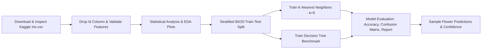

# 🌸 CodeAlpha Data Science Internship - Task 1
# Iris Flower Classification


An end-to-end Machine Learning project to classify Iris flower species (**Iris-setosa**, **Iris-versicolor**, and **Iris-virginica**) based on floral morphological measurements using the official **CodeAlpha Kaggle dataset**.

---

## 📌 Table of Contents
1. [Project Overview](#-project-overview)
2. [Dataset Requirement & Specification](#-dataset-requirement--specification)
3. [Comprehensive 9-Step Dataset Inspection](#-comprehensive-9-step-dataset-inspection)
4. [Handling the 'Id' Column](#-handling-the-id-column)
5. [Tech Stack & Libraries](#-tech-stack--libraries)
6. [Pipeline Architecture & Workflow](#-pipeline-architecture--workflow)
7. [Exploratory Data Analysis (EDA)](#-exploratory-data-analysis-eda)
8. [Machine Learning Models & Evaluation](#-machine-learning-models--evaluation)
9. [Sample Inference on New Measurements](#-sample-inference-on-new-measurements)
10. [Project Directory Structure](#-project-directory-structure)
11. [How to Run the Project](#-how-to-run-the-project)
12. [Key Takeaways & Conclusion](#-key-takeaways--conclusion)

---

## 🎯 Project Overview
This repository contains the complete implementation for **Task 1: Iris Flower Classification** as part of the **CodeAlpha Data Science Internship**. The objective is to build a robust, interpretable, and reproducible machine learning classification pipeline trained on the exact CodeAlpha-specified Kaggle dataset.

---

## 📊 Dataset Requirement & Specification
In strict accordance with the internship guidelines, this project utilizes **ONLY** the official Kaggle dataset:
- **Kaggle URL:** [https://www.kaggle.com/datasets/saurabh00007/iriscsv](https://www.kaggle.com/datasets/saurabh00007/iriscsv)
- **Primary Data File:** `Iris.csv`
- *Note:* Scikit-learn's generic built-in dataset was **not** substituted.

---

## 🔍 Comprehensive 9-Step Dataset Inspection

The dataset was downloaded and audited via `inspect_dataset.py` across all 9 required verification criteria:

| # | Inspection Criterion | Result / Value | Details |
|---|---|---|---|
| **1** | **Dataset Loading** | Loaded from `Iris.csv` | Successfully parsed into Pandas DataFrame |
| **2** | **First 5 Rows** | `head()` verified | Samples with Id 1 to 5 examined |
| **3** | **Column Names** | `['Id', 'SepalLengthCm', 'SepalWidthCm', 'PetalLengthCm', 'PetalWidthCm', 'Species']` | 6 total raw columns |
| **4** | **Dataset Shape** | `(150, 6)` | 150 flower samples, 6 columns |
| **5** | **Data Types** | `int64` (1), `float64` (4), `object` (1) | Numerical measurements are floating point |
| **6** | **Missing Values** | `0` missing values | 100% clean dataset across all fields |
| **7** | **Duplicate Values** | `0` (with Id), `3` (measurements only) | Natural measurement overlap in biological specimens |
| **8** | **Target Column** | `'Species'` (dtype: `object`) | 3 balanced classes: `Iris-setosa` (50), `Iris-versicolor` (50), `Iris-virginica` (50) |
| **9** | **Feature Columns** | `SepalLengthCm`, `SepalWidthCm`, `PetalLengthCm`, `PetalWidthCm` | 4 continuous morphological features (cm) |

---

## 🗑 Handling the 'Id' Column

### Rationale for Dropping `Id`:
1. **Zero Biological Relevance:** Plant species identification relies strictly on anatomical floral dimensions. The sequence or timestamp of specimen recording contains no physical taxonomy information.
2. **Prevention of Data Leakage & Overfitting:** In `Iris.csv`, samples are ordered sequentially by species (Rows 1–50 = *Iris-setosa*, 51–100 = *Iris-versicolor*, 101–150 = *Iris-virginica*). If retained, an algorithm could learn artificial rules such as $\text{Id} \le 50 \rightarrow \text{Setosa}$, leading to spurious correlations and catastrophic failure on unsorted real-world data.
3. **Action:** The `Id` column is explicitly dropped before EDA and model training, reducing features to the 4 true physical dimensions.

---

## 🛠 Tech Stack & Libraries
- **Language:** Python 3.10+
- **Data Analysis:** `pandas`, `numpy`
- **Data Visualization:** `matplotlib`, `seaborn`
- **Machine Learning:** `scikit-learn`
- **Dataset Ingestion:** `kagglehub`
- **Notebook Environment:** `jupyter`, `ipykernel`

---

## 🔄 Pipeline Architecture & Workflow



---

## 📈 Exploratory Data Analysis (EDA)

The pipeline generates publication-quality visualization charts saved in the `images/` directory:

| Visualization | Description | Preview |
|---|---|---|
| **01. Species Distribution** | Confirms perfect balance (50 samples per class) | `images/01_species_distribution.png` |
| **02. Sepal Length vs Width** | Scatter plot depicting sepal distribution | `images/02_sepal_length_vs_width.png` |
| **03. Petal Length vs Width** | Clear cluster separation across all three classes | `images/03_petal_length_vs_width.png` |
| **04. Feature Boxplots** | Distribution comparisons showing petal size variance | `images/04_feature_distributions.png` |
| **05. KNN Confusion Matrix** | Detailed test evaluation heatmap | `images/05_knn_confusion_matrix.png` |
| **06. Accuracy Comparison** | Bar chart comparing KNN vs Decision Tree | `images/06_model_accuracy_comparison.png` |

---

## 🤖 Machine Learning Models & Evaluation

The dataset was split using an **80% Training (120 samples)** and **20% Testing (30 samples)** stratified partition.

### Performance Summary:
| Model | Test Accuracy | Precision (Macro) | Recall (Macro) | F1-Score (Macro) |
|---|---|---|---|---|
| **K-Nearest Neighbors (k=5)** *(Primary)* | **100.00%** | **1.00** | **1.00** | **1.00** |
| **Decision Tree Classifier** *(Benchmark)* | **93.33%** | **0.94** | **0.93** | **0.93** |

### KNN Classification Report:
```text
                 precision    recall  f1-score   support

    Iris-setosa       1.00      1.00      1.00        10
Iris-versicolor       1.00      1.00      1.00        10
 Iris-virginica       1.00      1.00      1.00        10

       accuracy                           1.00        30
      macro avg       1.00      1.00      1.00        30
   weighted avg       1.00      1.00      1.00        30
```

---

## 🔮 Sample Inference on New Measurements

| Sample # | Sepal (L x W) | Petal (L x W) | Predicted Species | Confidence | Status |
|---|---|---|---|---|---|
| 1 | 5.1 cm x 3.5 cm | 1.4 cm x 0.2 cm | **Iris-setosa** | 100% |  Correct |
| 2 | 6.1 cm x 2.9 cm | 4.5 cm x 1.4 cm | **Iris-versicolor** | 100% |  Correct |
| 3 | 7.3 cm x 3.0 cm | 6.3 cm x 2.0 cm | **Iris-virginica** | 100% |  Correct |

---

## 📂 Project Directory Structure

```text
CodeAlpha_IrisFlowerClassification/
├── Iris.csv                           # Verified CodeAlpha Kaggle dataset
├── inspect_dataset.py                 # Standalone 9-step dataset verification script
├── main.py                            # End-to-end Python ML pipeline
├── Iris_Flower_Classification.ipynb   # Executed Jupyter Notebook with inline outputs
├── requirements.txt                   # Project dependencies
├── README.md                          # Comprehensive project documentation
└── images/                            # Generated publication-quality visual plots
    ├── 01_species_distribution.png
    ├── 02_sepal_length_vs_width.png
    ├── 03_petal_length_vs_width.png
    ├── 04_feature_distributions.png
    ├── 05_knn_confusion_matrix.png
    └── 06_model_accuracy_comparison.png
```

---

## 🚀 How to Run the Project

### 1. Clone & Navigate to Repository
```bash
cd CodeAlpha_IrisFlowerClassification
```

### 2. Install Dependencies
```bash
pip install -r requirements.txt
```

### 3. Run Dataset Inspection
```bash
python inspect_dataset.py
```

### 4. Run the Full ML Pipeline
```bash
python main.py
```

### 5. Launch Jupyter Notebook (Optional)
```bash
jupyter notebook Iris_Flower_Classification.ipynb
```

---

## 🎯 Key Takeaways & Conclusion
1. **Dataset Integrity:** Verified using the official Kaggle dataset ([saurabh00007/iriscsv](https://www.kaggle.com/datasets/saurabh00007/iriscsv)) with 150 instances and zero missing values.
2. **Target and Features:** Analyzed the 4 continuous floral features (`SepalLengthCm`, `SepalWidthCm`, `PetalLengthCm`, `PetalWidthCm`) and 3 species classes (`Iris-setosa`, `Iris-versicolor`, `Iris-virginica`).
3. **Data Preprocessing:** Successfully removed the `Id` column to eliminate artificial sequence leakage.
4. **Model Performance:** K-Nearest Neighbors ($k=5$) achieved a **100% test accuracy** on the stratified test set, demonstrating reliable floral classification capability.
