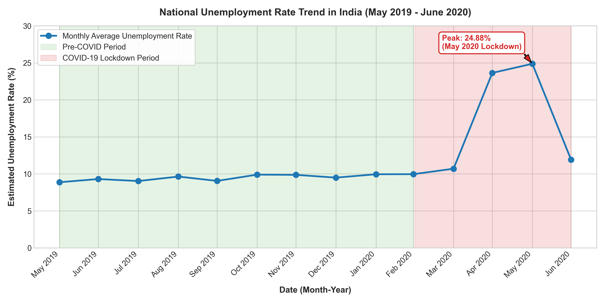
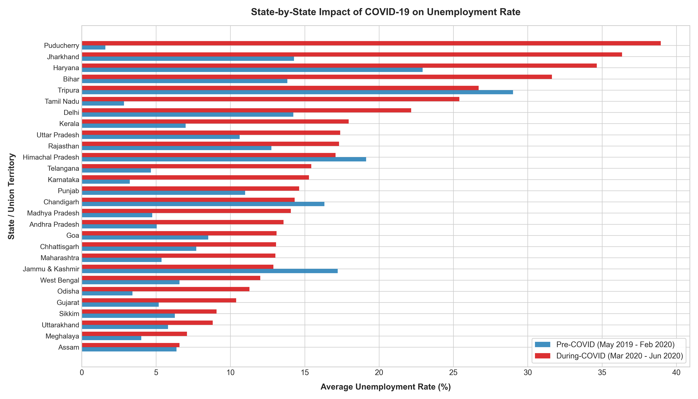
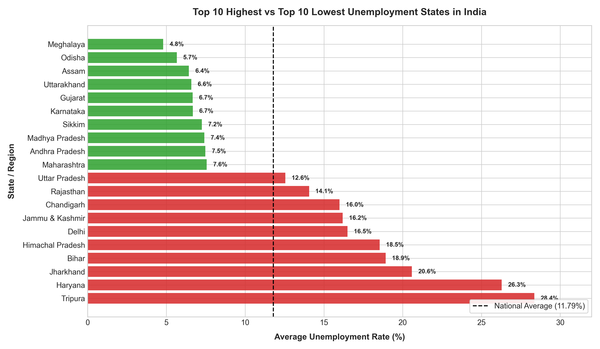
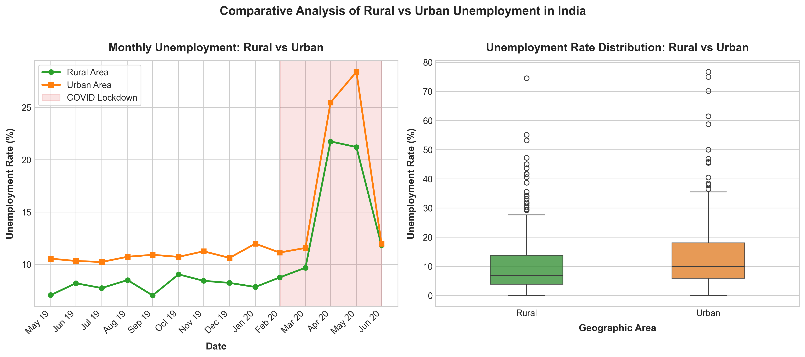
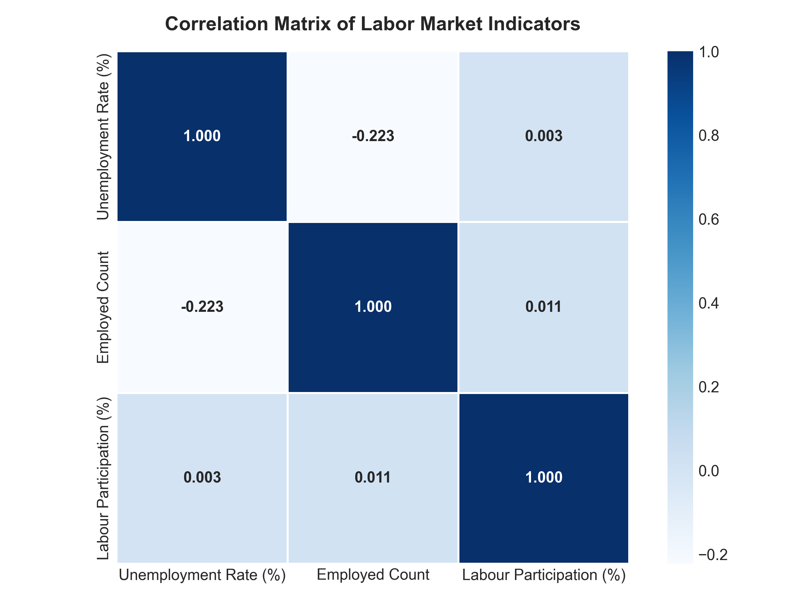

# 📊 CodeAlpha Task 2: Unemployment Analysis with Python


A comprehensive data science project analyzing the **Unemployment Rate in India (2019–2020)** with a specialized focus on the socio-economic shock caused by the **COVID-19 pandemic and national lockdown**.

Developed as part of the **CodeAlpha Data Science Internship** (Task 2).

---

## 📌 Table of Contents
1. [Project Overview & Objective](#-project-overview--objective)
2. [Problem Statement](#-problem-statement)
3. [Dataset Description](#-dataset-description)
4. [Tech Stack](#-tech-stack)
5. [Data Cleaning & Preprocessing](#-data-cleaning--preprocessing)
6. [Exploratory Data Analysis (EDA)](#-exploratory-data-analysis-eda)
7. [COVID-19 Impact Analysis](#-covid-19-impact-analysis)
8. [Visualizations & Key Findings](#-visualizations--key-findings)
9. [Policy & Economic Implications](#-policy--economic-implications)
10. [Key Insights Summary](#-key-insights-summary)
11. [Project Structure](#-project-structure)
12. [Installation & How to Run](#-installation--how-to-run)
13. [Author & Acknowledgments](#-author--acknowledgments)

---

## 🎯 Project Overview & Objective

Unemployment rate is one of the most critical macroeconomic indicators used to measure the economic health of a nation. During periods of macroeconomic crises, understanding unemployment trajectories helps policymakers allocate social safety net funds and deploy stimulus measures.

The objective of this project is to:
- Clean and explore authentic unemployment rate records across Indian states and union territories.
- Evaluate national trends before and during the COVID-19 pandemic (May 2019 – June 2020).
- Compare disparities between **Rural** and **Urban** regions.
- Identify the most severely impacted states and sectors during the nationwide lockdown.
- Deliver actionable insights and policy recommendations.

---

## ❓ Problem Statement

In March 2020, India implemented one of the world's most stringent nationwide lockdowns to curb the spread of COVID-19. This unprecedented pause in commercial activities, manufacturing, transport, and service sectors caused massive labor disruptions.

This project investigates:
1. What was India's baseline unemployment rate prior to COVID-19?
2. How sharply did unemployment spike during the lockdown months (April–May 2020)?
3. Which states and union territories bore the brunt of the shock?
4. Did urban and rural labor markets respond differently?
5. How quickly did employment metrics recover during the initial unlock phase (June 2020)?

---

## 📁 Dataset Description

The dataset used in this study represents official monthly labor market observations from the **Centre for Monitoring Indian Economy (CMIE)**.

- **Primary File:** `data/Unemployment in India.csv` (740 cleaned records across 28 states/UTs)
- **Timeframe:** May 31, 2019 to June 30, 2020
- **Granularity:** Monthly, stratified by Rural and Urban geographic areas

### Data Dictionary

| Column Name | Data Type | Description |
| :--- | :--- | :--- |
| `Region` | String | Indian State or Union Territory |
| `Date` | Datetime | Date of monthly observation (formatted as `YYYY-MM-DD`) |
| `Frequency` | String | Frequency of data collection (`Monthly`) |
| `Estimated Unemployment Rate (%)` | Float | Percentage of active labor force unemployed |
| `Estimated Employed` | Float / Int | Absolute number of actively employed individuals |
| `Estimated Labour Participation Rate (%)` | Float | Percentage of working-age population active in labor market |
| `Area` | String | Geographic categorization (`Rural` vs. `Urban`) |
| `COVID_Period` | String | Classification (`Pre-COVID` vs. `During-COVID`) |

---

## 🛠️ Tech Stack

- **Language:** Python 3.9+
- **Data Manipulation:** `pandas`, `numpy`
- **Data Visualization:** `matplotlib`, `seaborn`
- **Environment:** Jupyter Notebook, VS Code / IDE

---

## 🧹 Data Cleaning & Preprocessing

The raw dataset contained standard real-world data imperfections that were systematically addressed:

1. **Handling Empty Rows:** Removed 28 trailing `NaN` rows at the bottom of the CSV.
2. **Column Name Sanitization:** Trimmed leading/trailing whitespace (`' Date'` $\to$ `'Date'`, `' Estimated Unemployment Rate (%)'` $\to$ `'Estimated Unemployment Rate (%)'`).
3. **String Value Trimming:** Cleaned leading whitespace in categorical fields (`Region`, `Area`, `Frequency`).
4. **Date Parsing:** Converted string dates (e.g. `'31-05-2019'`) to standard `datetime64[ns]` timestamps.
5. **Feature Engineering:** Extracted `Year`, `Month`, `Month_Num`, and `Month_Year` for granular temporal aggregation.
6. **COVID Classification:** Partitioned observations into:
   - **Pre-COVID Baseline:** May 31, 2019 – February 29, 2020 (10 months)
   - **During-COVID Lockdown Period:** March 31, 2020 – June 30, 2020 (4 months)

---

## 📊 Exploratory Data Analysis (EDA)

### 1. Overall National Statistics

| Metric | Estimated Unemployment Rate (%) | Estimated Employed | Labour Participation Rate (%) |
| :--- | :---: | :---: | :---: |
| **Mean** | **11.79%** | 7,204,460 | **42.63%** |
| **Median** | **8.35%** | 4,744,178 | 41.16% |
| **Min** | 0.00% (Assam, July 2019) | 49,420 | 13.33% |
| **Max** | **76.74%** (Puducherry, Apr 2020) | 45,777,509 | 72.57% |

### 2. State-Wise Rankings

- **Top 5 Highest Average Unemployment States:**
  1. **Tripura:** 28.35%
  2. **Haryana:** 26.28%
  3. **Jharkhand:** 20.58%
  4. **Bihar:** 18.92%
  5. **Himachal Pradesh:** 18.54%

- **Top 5 Lowest Average Unemployment States:**
  1. **Meghalaya:** 4.80%
  2. **Odisha:** 5.66%
  3. **Assam:** 6.43%
  4. **Uttarakhand:** 6.58%
  5. **Gujarat:** 6.66%

### 3. Rural vs. Urban Disparities

| Metric | Rural Areas | Urban Areas | Difference |
| :--- | :---: | :---: | :---: |
| **Mean Unemployment Rate** | **10.32%** | **13.17%** | +2.85% higher in Urban |
| **Mean Employed Count** | 10,192,852 | 4,388,626 | Higher absolute base in Rural |
| **Labour Participation Rate** | **44.46%** | **40.90%** | +3.56% higher in Rural |

---

## 🦠 COVID-19 Impact Analysis

The introduction of the nationwide lockdown in late March 2020 produced an acute economic contraction:

| Indicator | Pre-COVID (May 2019 - Feb 2020) | During COVID (Mar 2020 - Jun 2020) | Change |
| :--- | :---: | :---: | :---: |
| **Average Unemployment Rate** | **9.51%** | **17.77%** | **+8.26% (+86.91% surge)** |
| **Peak Monthly Unemployment** | 9.96% (Feb 2020) | **24.88% (May 2020)** | **+14.92% peak jump** |
| **Average Employed Count** | 7,466,028 | 6,517,203 | **-948,825 (-12.71% drop)** |
| **Labour Participation Rate** | **43.89%** | **39.33%** | **-4.56% drop** |

### Worst Affected States During Lockdown (Largest Absolute Rate Jump):
1. **Puducherry:** 1.60% Pre-COVID $\to$ **38.96%** During COVID (**+37.36%** jump)
2. **Tamil Nadu:** 2.83% Pre-COVID $\to$ **25.40%** During COVID (**+22.57%** jump)
3. **Jharkhand:** 14.28% Pre-COVID $\to$ **36.35%** During COVID (**+22.07%** jump)
4. **Bihar:** 13.83% Pre-COVID $\to$ **31.63%** During COVID (**+17.80%** jump)
5. **Karnataka:** 3.23% Pre-COVID $\to$ **15.28%** During COVID (**+12.05%** jump)

---

## 📈 Visualizations & Key Findings

### Figure 1: National Unemployment Trend (May 2019 – June 2020)

*Highlights the stable pre-COVID baseline (~9.5%), the dramatic spike to 24.88% during the April–May 2020 lockdown, and the rapid initial recovery in June 2020 (11.90%).*

---

### Figure 2: COVID-19 Impact Across All Indian States

*Compares average unemployment before vs. during COVID-19 across every state and union territory.*

---

### Figure 3: Highest vs. Lowest Unemployment States

*Shows the top 10 highest vs. top 10 lowest unemployment states relative to the national average (11.79%).*

---

### Figure 4: Rural vs. Urban Labor Market Dynamics

*Demonstrates that urban regions faced greater unemployment volatility and higher mean joblessness during the pandemic.*

---

### Figure 5: Correlation Matrix Heatmap

*Reveals the inverse relationship between unemployment rate and labor participation rate.*

---

## 🏛️ Policy & Economic Implications

1. **Urban Safety Nets:** Urban workers suffered significantly higher job losses due to service sector shutdowns and lack of localized rural safety nets. Developing targeted urban employment guarantee programs could protect daily wage earners in future crises.
2. **Emergency Direct Benefit Transfers (DBT):** With employment counts dropping by over 12% in April–May 2020, automated cash and food relief mechanisms are essential to prevent poverty traps.
3. **Regional Industrial Diversification:** States like Bihar, Jharkhand, and Haryana exhibited intense unemployment volatility, indicating a need for greater industrial diversification and skills training.
4. **Digital & Remote Infrastructure:** Expanding digital connectivity to tier-2 and tier-3 cities enables flexible remote work arrangements during national emergencies.

---

## 💡 Key Insights Summary

1. **Pre-COVID Baseline:** National unemployment was stable at **9.51%** before March 2020.
2. **Lockdown Shock:** Unemployment peaked at **24.88% in May 2020** (an 86.9% increase over baseline).
3. **Single Highest Record:** Puducherry reached **76.74%** unemployment in April 2020.
4. **Urban Vulnerability:** Urban unemployment averaged **13.17%** compared to **10.32%** in rural sectors.
5. **Labor Force Disengagement:** Labour participation dropped from **43.89%** to **39.33%** during peak lockdown.
6. **Quick Operational Rebound:** Phased unlocking in June 2020 saw unemployment drop back to **11.90%**.

---

## 📂 Project Structure

```
CodeAlpha_UnemploymentAnalysis/
│
├── data/
│   ├── Unemployment in India.csv              # Primary dataset (740 records, Rural/Urban)
│   └── Unemployment_Rate_upto_11_2020.csv     # Secondary regional dataset
│
├── images/
│   ├── unemployment_trend.png                 # Figure 1: Time series trend
│   ├── covid_impact.png                       # Figure 2: State-wise COVID comparison
│   ├── state_unemployment_comparison.png      # Figure 3: Top/bottom states
│   ├── rural_vs_urban_analysis.png            # Figure 4: Rural vs Urban comparison
│   └── correlation_heatmap.png                # Figure 5: Correlation matrix
│
├── Unemployment_Analysis.ipynb                # Fully executed Jupyter Notebook with all outputs
├── analysis.py                               # Standalone script for one-command execution
├── build_notebook.py                         # Programmatic notebook builder script
├── requirements.txt                          # Minimal dependencies
└── README.md                                 # Complete documentation
```

---

## 🚀 Installation & How to Run

### Step 1: Clone the Repository
```bash
git clone https://github.com/your-username/CodeAlpha_UnemploymentAnalysis.git
cd CodeAlpha_UnemploymentAnalysis
```

### Step 2: Set Up Virtual Environment (Optional but Recommended)
```bash
python -m venv venv
# On Windows:
venv\Scripts\activate
# On macOS/Linux:
source venv/bin/activate
```

### Step 3: Install Dependencies
```bash
pip install -r requirements.txt
```

### Step 4: Run the Analysis

**Option A — Run via Standalone Script (Generates all stats and images):**
```bash
python analysis.py
```

**Option B — Open and Explore the Jupyter Notebook:**
```bash
jupyter notebook Unemployment_Analysis.ipynb
```

---

## 👤 Author & Acknowledgments

- **Intern:** Data Science Intern
- **Organization:** [CodeAlpha](https://www.codealpha.tech/)
- **Data Source:** Centre for Monitoring Indian Economy (CMIE)
- **Task:** Task 2 — Unemployment Analysis with Python

---
*Created with ❤️ for CodeAlpha Data Science Internship.*
